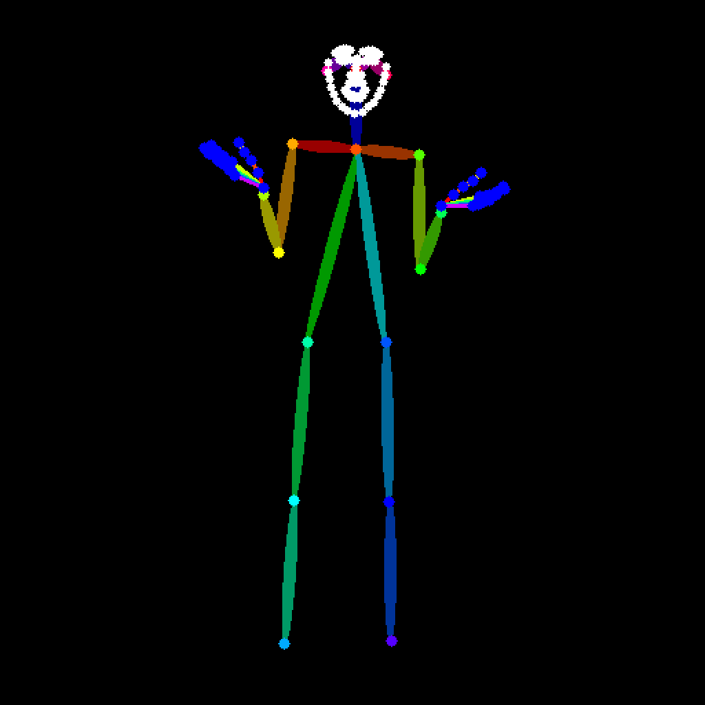

# Full MultiControlNet Support for Stable Diffusion 3

This repository provides a workaround to enable **MultiControlNet** functionality for all available ControlNets in Stable Diffusion 3 (SD3). As of December 20, 2024, the following [ControlNets are supported](https://huggingface.co/docs/diffusers/en/api/pipelines/controlnet_sd3):
1. [Canny](https://huggingface.co/InstantX/SD3-Controlnet-Canny)
2. [Pose](https://huggingface.co/InstantX/SD3-Controlnet-Pose)
3. [Tile](https://huggingface.co/InstantX/SD3-Controlnet-Tile)
4. [Inpainting](https://huggingface.co/alimama-creative/SD3-Controlnet-Inpainting)

## Background
- **Canny**, **Pose**, and **Tile** ControlNets are developed by the [InstantX team](https://huggingface.co/InstantX).
- **Inpainting** ControlNet is provided by the [AlimamaCreative team](https://huggingface.co/alimama-creative/SD3-Controlnet-Inpainting).

While the official [HuggingFace Diffusers](https://github.com/huggingface/diffusers) library includes support for MultiControlNet with ControlNets from the InstantX team (see [pipeline_stable_diffusion_3_controlnet.py](https://github.com/huggingface/diffusers/blob/main/src/diffusers/pipelines/controlnet_sd3/pipeline_stable_diffusion_3_controlnet.py)), it does not provide support for combining these with the Inpainting ControlNet from AlimamaCreative.

## Limitations in Official Code

The official SD3ControlNetInpaintingPipeline explicitly does not support MultiControlNet (as of 20.12.2024), as shown in the following snippet from the source code:
```python
elif isinstance(self.controlnet, SD3MultiControlNetModel):
    raise NotImplementedError("MultiControlNetModel is not supported for SD3ControlNetInpaintingPipeline.")
```
## Purpose of This Repository

This repository introduces a **hack** to bypass the limitation and enable **MultiControlNet** functionality for Inpainting in combination with other ControlNets. The modifications are minimal and maintain compatibility with the original codebase.

### Inputs
<div align="center">
<p float="left">
<figure style="display: inline-block; margin: 0 1px; width: 200px;">

</figure>
<figure style="display: inline-block; margin: 0 1px; width: 200px;">

</figure>
<figure style="display: inline-block; margin: 0 1px; width: 200px;">

</figure>
</p>
</div>
<p align="center">
<b>a.</b> Image; &emsp; <b>b.</b> Mask; &emsp; <b>c.</b> Pose;
</p>

### Results
<div align="center">
<p float="left">
<figure style="display: inline-block; margin: 0 5px; width: 200px;">

</figure>
<figure style="display: inline-block; margin: 0 5px; width: 200px;">

</figure>
<figure style="display: inline-block; margin: 0 5px; width: 200px;">

</figure>
<figure style="display: inline-block; margin: 0 5px; width: 200px;">

</figure>
</p>
</div>

<p align="center">
<b>a.</b> Vanilla Text to Image; &emsp; <b>b.</b> Inpainting; &emsp; <b>c.</b> OpenPose; &emsp; <b>d.</b> Inpainting + OpenPose 
</p>

## Files Included
This repository includes only two modified files:
- [pipeline_sd3_controlnet_inpaint_custom.py](pipeline_sd3_controlnet_inpaint_custom.py)
- [custom_controlnet_sd3.py](custom_controlnet_sd3.py)

## Usage

In [example_notebook.ipynb](example_notebook.ipynb) there is a an example of a MultiControlNet Pose + Inpainting. 

## Disclaimer

This implementation is a workaround and may not be fully optimized. Use it with caution, and consider contributing to an official solution if needed.

## Future work
If time permits, I plan to refine this implementation and submit a pull request to integrate it into the official Diffusers library.

## Notes

Update libraries beforehands
```bash
pip install --upgrade transformers diffusers accelerate
```